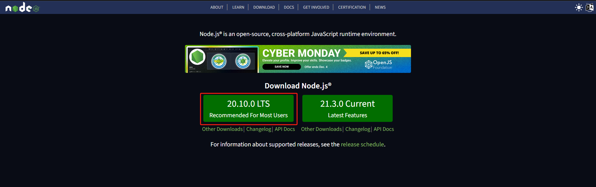

# 项目描述

web版报表在线编辑器

## 准备工作

### 安装Nodejs

如未安装Nodejs，请前往[【Nodejs 官网】](https://nodejs.org/en/)下载稳定版本并安装。

####


### 环境初始化

目前vendor-report使用[【pnpm】](https://pnpm.io/zh/)进行nodejs插件管理，如未安装pnpm，请使用以下命令进行安装：
```sh
npm install -g pnpm
```
pnpm安装完成后，使用以下命令进行项目初始化：
```sh
pnpm install
```

## 报表设计器

本地开启报表设计器预览服务，执行以下命令：
```js
pnpm run designer
```

## Build说明
注意：build时会删除dist目录，如果该目录有私有数据，在build前请备份私有数据。

## 相关参考文档

### pnpm

https://pnpm.io/zh/

### spreadjs

#### Demos

https://developer.mescius.com/spreadjs/demos

#### API

https://developer.mescius.com/spreadjs/api/modules/GC.Data

### React

https://react.docschina.org/

### React Redux

https://cn.react-redux.js.org/
